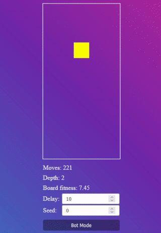

# Tetris A.I.

Another Tetris A.I.

Calculates the best movements for a Tetris game.

<p align="center">
  
</p>

---

## Running

Install dependencies: `yarn`<br>
Run: `yarn start`

---

Simulates near possible movements, calculate the score of each and chooses the best based on score.

The depth of the search is based on "how good" the board currently is(highest block Y). Currently, if left 8 blocks on Y to reach the top of the board, depth=3, if greater than 8, depth=2, if greater than 16, depth=1. These values are arbitrary.

The score/fitness of a board is calculated in the following way:

```ts
  (holesCount * -2) +
  (yLevelsVariance * -6 * ((1 - (minY / boardHeight)) * 2)) +
  (yLevelsMean * 1)
```

A `Hole` is every block that is below a solid block.<br>
`Y Levels` are the distance of each column from the top of the board to the highest solid block in that column.<br>
`Y Levels Variance` is the standard deviation(ya, maybe change the name to "Y Levels Std Dev") of the Y Levels array.<br>
`Min Y` is the lowest value of Y Levels.<br>
`Y Levels Mean` is the mean of Y Levels array.<br>

The -2, -6, 2 and 1 are weights and can be changed.
